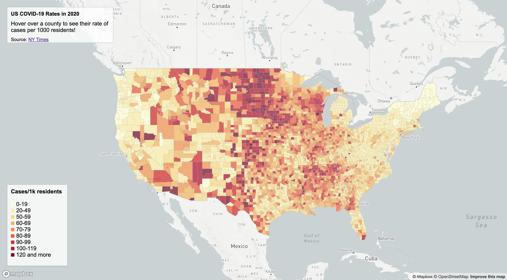
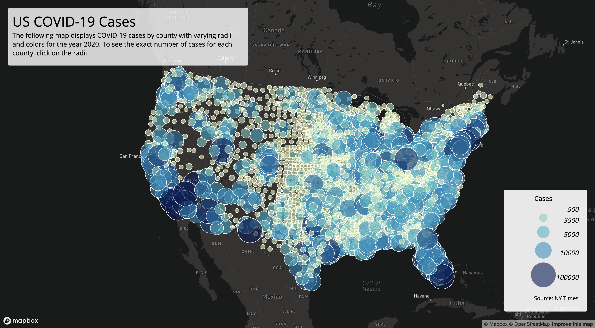

# Lab 3: US COVID-19 Rates and Counts

The following maps interactively display COVID-19 cases per county and COVID-19 rates per county in the United States from the year 2020, as the data shows from [The New York Times](https://github.com/nytimes/covid-19-data/blob/43d32dde2f87bd4dafbb7d23f5d9e878124018b8/live/us-counties.csv). The data on the population to calculate the rate of cases is from the [2018 ACS 5 year Estimates](https://data.census.gov/cedsci/table?g=0100000US.050000&d=ACS%205-Year%20Estimates%20Data%20Profiles&tid=ACSDP5Y2018.DP05&hidePreview=true) and the county boundaries to display the different counties is from the [U.S. Census Bureau](https://www.census.gov/geographies/mapping-files/time-series/geo/carto-boundary-file.html).

## [US COVID-19 Rates](https://phammy22.github.io/US_COVID19_Rates_lab03/map1.html)

This is a choropleth map that displays the rate of cases per 1000 residents in each state's county. As the rate of cases increases, the color becomes more dark and red so that counties with higher rates can be easily understood. If a user is curious about the exact rate in a specific county, then can use their mouse to hover over a county and the county and rate is displayed in the title box.

## [US COVID-19 Cases](https://phammy22.github.io/US_COVID19_Rates_lab03/map2.html)

This is a proportional symbol map of the count of cases in each county. As the count increases, the color becomes more blue and the radii becomes larger so that it is easy to see what counties have more cases. If a user wants to know about the exact count of cases in a specific county, they can click on the radii they are interested in and a popup with the number of cases is displayed.
